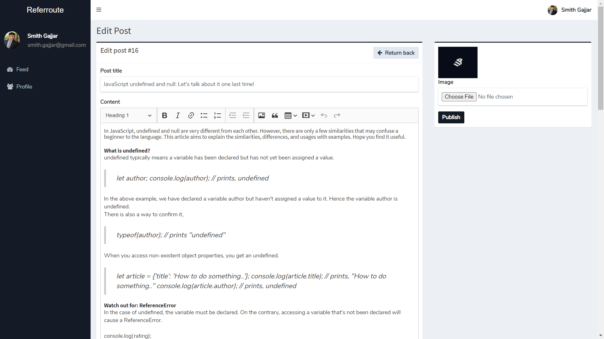

# Assignment
To develop the below features by using React.js, Laravel, MySOL and deploy it on a server (preferable AWS).

**Live Url :**  https://referroute.herokuapp.com/

**Test Accounts :** 
 1.  Email  : admin@email.com , Password : admin09 
 2. Email : adc@email.com , Password : 123456

**Feature List:**
 - [x] (1) Login
 - [x] (2) Sign up 
 - [x] (3) Edit Profile: 
    - [ ] Exact Location (Google places API) 
        (*Note : Currently storing location as a string only)
 - [x] (3) Profile View
 - [x] (4) New Post 
 - [x] (4) Post view 
 - [x] (4) Like Button
 - [x] (5) Make sure when a user makes a post the other user can see it.
 
**Addition Features Added**
 - [x] Edit Post 
 - [x] Delete Post
 - [x] Advance Editor for post content (ckeditor)
 - [x] Image Upload for Post
 - [x] Pagination for Posts

### Tech Stack 
 - Laravel 
 - React 
 - Redux
 - MySQL

### Platforms Used
- [Heroku](https://www.heroku.com/) (For Hosting)
- [db4free.net](https://db4free.net/) (For MYSQL host)

### Run Project Locally 
Clone the repository. Do the following steps to get it up and running:
1. Set your db configuration in .env
2. `composer install`
3. `npm install`
4. `php artisan migrate`
5. `npm run watch` *(To start React frontend)
6. `php artisan serve` *(To start Laravel backend api)

You can access the application at http://127.0.0.1:8000/

***For react production build** - execute `npm run prod`

### Laravel API Documentation  

(\*) represents routes which requires authorization header as - Bearer <API TOKEN>

 | Routes | Method | Description | 
 |:----------|:-------------:|:------| 
 | api/login | POST | Login route. | 
 | api/logout | GET | User Logout. | 
 | api/register | POST | User registeration. | 
 | api/check-auth | GET | Authenticate user. | 
 | api/profile | GET | Get user profile. | 
 | api/profile/update | POST | Update user profile. | 
 | api/posts?page= | GET | List all posts. (Returns 10 items per page with pagination data )| 
 | api/posts/:id | GET | Get post by id. | 
 | api/posts | POST | Create new post. | 
 | api/posts/likes | POST | Like post by id. | 
 | api/posts/:id | PUT | Edit post by id. | 
 | *api/posts/:id | DELETE | Delete post by id. |

### Blogs / Documentations Refered During Development

- https://www.flowkl.com/tutorial/web-development/simple-blog-application-in-laravel-7/
- https://redux.js.org/introduction/getting-started
- https://dev.to/lvtdeveloper/using-react-in-a-laravel-application-8fp
- https://laravel.com/docs/8.x/pagination
- https://laravel.com/docs/8.x
- https://ckeditor.com/docs/ckeditor5/latest/builds/
- https://kevinwkds.medium.com/laravel-deployment-in-aws-ec2-aee3ded6248f *(For AWS Hosting)

### Screenshots

